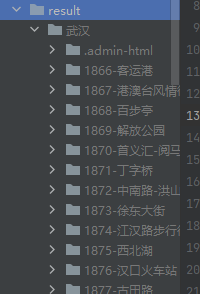

# Hav-DianPing-Creeper

## 项目前身及原基本介绍
### 原项目介绍
https://github.com/fangzuli/Crawler

代码功能：简单低频爬取大众点评指定店铺评论中的无水印图片，同样修改代码也适配小红书。

免责声明：本代码仅做知识学习之用，请勿使用该代码进行一些违反法律法规的事情，如若他用与本人无关。

### Hav:
虽然原项目只实现了对目标 shop 爬取评论图片，不过其 UA 随机替换、 IP 代理操作等部分的实现很有参考意义。

本人爬虫经验不多，自我感觉写的有些臃肿。（还请见谅，有问题就发群）

## 使用教程
首先准备python环境， 安装requirement.txt中的模块(`pip install -r requirements.txt`)，此项目我使用的是python3.8，不过其他常见版本都可以试一下。
1. 首先下载配置 MongoDB 并开放端口。(__因为此项目实现断点重连的方式是从数据库的最后一个文档的信息来逆推断点状态，所以建议多人不要使用相同的 MongoDB，先本地，之后再整合吧。__) 可参考博客：https://blog.csdn.net/efew212efe/article/details/124524863 配置。
2. 修改config/config.yaml文件，配置好要爬取的网站链接、header以及爬取过程中的一些参数。（详细见下）
3. 通过模块执行 `python -m crawler`。

## config 配置细节
1. 对于目标爬取对象，已封装到直接设定目标城市。修改下图 `name` 为特定城市便可。

2. headers 部分需要设定为当前 PC 登录的账号，可以在大众点评的 web 的具体一个 shop 中捕获网络中的 headers 信息，重点就是修改 Cookies，来标记账号信息。

比如，随便进入 shop 详细页之后，从 allReview 的连接中获取 headers 信息，部分其他 api 亦可，我个人常用这个。

猜测 Cookies 中可能带有时间戳信息，我是每次执行前都重新获取一遍。
3. MongoDB 配置，设定对应的主机号、端口、数据库名。因为此项目实现断点重连的方式是从数据库的最后一个文档的信息来逆推断点状态，所以建议多人不要使用相同的 MongoDB，先本地，之后再整合吧。

## 碎碎念
### requirements.txt
此项目为本人一个用于爬虫的虚拟环境中的一个子项目，requirements 中存在不少冗余，手动删去了一些，或许有 BUG，可以根据 python 报错逐个安装。
### windows 系统通知
增加了连接 windows 系统通知的模块，不必长期监督程序运行状态，不过只在先简单在重点的几个点位实现了 notice 处理，所以还是存在部分情况出现没有提醒。

另外，关于下载图片时会根据定时器来触发 notice，不过有时候只是网速问题，多等一段时间看是否真的卡住了，最近两三天（7.31）没见这个问题，大都多等一会就好，之前还挺多。
### core.py
核心模块，个人感觉写的很 poop... 不断扩展到700多行了，页拆分出了一些子模块到其他文件，但可能理解起来会有一定困难。
### 最常见的错误
403，那基本就是被官方ban了，短时间无法请求重点页面，需要换号换Cookies，同时页也可以调整访问速度的设定。
### 图片数据存储位置

